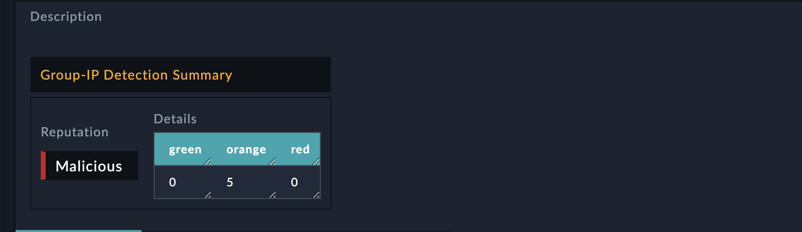

<h2>About the connector</h2>

Use Group-IB Threat Intelligence &amp; Attribution Feed integration to fetch IOCs from various Group-IB collections.

This document provides information about the Group IB Threat Intelligence & Attribution Feed Connector, which facilitates automated interactions, with a Group IB Threat Intelligence & Attribution Feed server using FortiSOAR&trade; playbooks. Add the Group IB Threat Intelligence & Attribution Feed Connector as a step in FortiSOAR&trade; playbooks and perform automated operations with Group IB Threat Intelligence & Attribution Feed.

<h3>Version information</h3>

Connector Version: 1.1.0

Authored By: Fortinet CSE

Contributors: Naili.M

Certified: No

<h2>Installing the connector</h2>

From FortiSOAR&trade; 5.0.0 onwards, use the <strong>Connector Store</strong> to install the connector. For the detailed procedure to install a connector, click <a href="https://docs.fortinet.com/document/fortisoar/0.0.0/installing-a-connector/1/installing-a-connector" target="_top">here</a>. You can also use the <code>yum</code> command as a root user to install the connector:

<code>yum install cyops-connector-group-ib-threat-intelligence-attribution-feed</code>

<h2>Prerequisites to configuring the connector</h2>

<ul>
<li>You must have the URL of Group IB Threat Intelligence &amp; Attribution Feed server to which you will connect and perform automated operations and credentials to access that server.</li>
<li>The FortiSOAR&trade; server should have outbound connectivity to port 443 on the Group IB Threat Intelligence &amp; Attribution Feed server.</li>
</ul>

<h2>Minimum Permissions Required</h2>

<ul>
<li>N/A</li>
</ul>

<h2>Configuring the connector</h2>

For the procedure to configure a connector, click <a href="https://docs.fortinet.com/document/fortisoar/0.0.0/configuring-a-connector/1/configuring-a-connector">here</a>

<h3>Configuration parameters</h3>

In FortiSOAR&trade;, on the Connectors page, click the <strong>Group IB Threat Intelligence & Attribution Feed</strong> connector row (if you are in the <strong>Grid</strong> view on the Connectors page) and in the <strong>Configurations&nbsp;</strong> tab enter the required configuration details:&nbsp;

<table border=1><thead><tr><th>Parameter </th><th>Description </th></tr></thead><tbody><tr><td>Server URL </td><td>URL of the Group IB server to which you will connect and perform the automated operations. 
<tr><td>Username </td><td>Username used to access the Group IB server to which you will connect and perform the automated operations. 
<tr><td>Password </td><td>Password used to access the Group IB server to which you will connect and perform the automated operations. 
<tr><td>Verify SSL </td><td>Specifies whether the SSL certificate for the server is to be verified or not.  By default, this option is set as True. </td></tr>
</tbody></table>

<h2>Actions supported by the connector</h2>

The following automated operations can be included in playbooks and you can also use the annotations to access operations from FortiSOAR&trade; release 4.10.0 and onwards:

<table border=1><thead><tr><th>Function </th><th>Description </th><th>Annotation and Category </th></tr></thead><tbody><tr><td>Search Indicator </td><td>Find indicator and its metadata on Group IB Database. </td><td>search_indicator  Investigation </td></tr>
<tr><td>Get Indicators </td><td>Retrieves a limited number of indicators for the specified Group IB collection, and all indicators for a particular incident if you have specified the incident ID. </td><td>get_indicators  Investigation </td></tr>
</tbody></table>

<h3>operation: Search Indicator</h3>

<h4>Input parameters</h4>

<table border=1><thead><tr><th>Parameter </th><th>Description </th></tr></thead><tbody><tr><td>Indicator </td><td>Value of the indicator to search for in GroupIB DB. 
</td></tr><tr><td>Limit </td><td>Limit how many records to return per match. 
</td></tr></tbody></table>

<h4>Output</h4>

The output contains a non-dictionary value.

<h3>operation: Get Indicators</h3>

<h4>Input parameters</h4>

<table border=1><thead><tr><th>Parameter </th><th>Description </th></tr></thead><tbody><tr><td>Collection </td><td>The Group IB Collection from which you want to retrieve indicators. You can choose from the following options: compromised/mule, compromised/imei, attacks/ddos, attacks/deface, attacks/phishing, attacks/phishing_kit, hi/threat, apt/threat, osi/vulnerability, suspicious_ip/tor_node, suspicious_ip/open_proxy, suspicious_ip/socks_proxy, or malware/cnc. 
</td></tr><tr><td>Incident ID </td><td>The incident ID whose associated indicators you want to retrieve from Group IB. 
</td></tr><tr><td>Limit </td><td>The maximum number of indicators that you want to display in the War Room. You can specify the following values: 10, 20, 30, 40, or 50. By default, the limit is set to 50. 
</td></tr></tbody></table>

<h4>Output</h4>

The output contains the following populated JSON schema:
<code> {
</code><code> &nbsp;&nbsp;&nbsp;&nbsp;    "value": "",
</code><code> &nbsp;&nbsp;&nbsp;&nbsp;    "type": "",
</code><code> &nbsp;&nbsp;&nbsp;&nbsp;    "asn": "",
</code><code> &nbsp;&nbsp;&nbsp;&nbsp;    "geocountry": "",
</code><code> &nbsp;&nbsp;&nbsp;&nbsp;    "gibmalwarename": ""
</code><code> }</code>

<h2>Included playbooks</h2>

The <code>Sample - group-ib-threat-intelligence-attribution-feed - 1.1.0</code> playbook collection comes bundled with the Group IB Threat Intelligence &amp; Attribution Feed connector. These playbooks contain steps using which you can perform all supported actions. You can see bundled playbooks in the <strong>Automation</strong> &gt; <strong>Playbooks</strong> section in FortiSOARTM after importing the Group IB Threat Intelligence &amp; Attribution Feed connector.

<ul>
<li>Search Indicator</li>
<li>Get Indicators</li>
</ul>

<strong>Note</strong>: If you are planning to use any of the sample playbooks in your environment, ensure that you clone those playbooks and move them to a different collection since the sample playbook collection gets deleted during the connector upgrade and delete.

<h2>Pluggable Enrichment</h2>

The <em><code>Sample - Group IB Threat Intelligence & Attribution Feed - 1.1.0</code></em> playbook collection contains pluggable enrichment playbooks that are used to provide verdicts for indicator types IP Address, File Hash, URL, and Domain. The pluggable enrichment playbooks are in the format: <strong><em>indicatorType</em> &gt; Group IB Threat Intelligence &gt; Enrichment</strong>. For example, <strong><em>File Hash / Domain / IP / URL</em> &gt; Group IB Threat Intelligence &gt; Enrichment</strong>.

The Configuration step in all the pluggable enrichment playbooks contains variables that have default values for calculating the Verdict for various indicator types.

<h3>Default variables for all supported indicator
types</h3>

The Group IB Threat Intelligence integration API response returns the <code>verdict</code>, <code>cti_score</code>, <code>enrichment_summary</code>, and other variables as listed in the following table:

<table border="1">
	<tbody>
		<tr>
			<th>Variable Name</th>
			<th>Description</th>
			<th>Return Value</th>
		</tr>
		<tr>
			<td><code>verdict</code></td>
			<td>This connector returns a high-reliability value called <code>verdict</code>. Use this verdict to find the reputation of the various types of indicators.</td>
			<td>
			
if the value in <code>vars.reputation.score</code> < <code>0</code> then the verdict returned is <em>No Reputation Available</em>

            
if the value in <code>0</code><= <code>vars.reputation.score</code> < <code>3</code> then the verdict returned is <em>Good</em>

            
if the value in <code>3</code><= <code>vars.reputation.score</code> < <code> 10 </code> then the verdict returned is <em>Suspicious</em>

            
if the value in <code>vars.reputation.score</code> >=<code>10</code> then the verdict returned is <em>Malicious</em>

			</td>
		</tr>
		<tr>
			<td><code>cti_name</code></td>
			<td>The name of the connector is called the CTI (Cyber Threat Intelligence) name</td>
			<td><code>Group IB Threat Intelligence</code></td>
		</tr>
		<tr>
			<td><code>cti_score</code></td>
			<td>The verdict value returned by the integration API.</td>
			<td>
			Returns the total score value in 
            
<code>green</code>=<code>vars.scores.green</code> * <code>0</code>

            
<code>orange</code>=<code>vars.scores.orange</code> * <code>2</code>

            
<code>red</code>=<code>vars.scores.red</code> * <code>4</code>

            
<code>total</code>=<code>green</code>+<code>red</code>+<code>red</code>

If <code>vars.scores.green</code> == <code>0</code> and <code>vars.scores.red</code> == <code>0</code> and <code>vars.scores.orange</code> == <code>0</code> , it returns an empty value -1

</td>
		</tr>
		<tr>
			<td><code>source_data</code></td>
			<td>The <code>source_data</code> response returned by the integration API.</td>
			<td>A JSON response object containing the source data of the threat intelligence integration.</td>
		</tr>
		<tr>
			<td><code>field_mapping</code></td>
			<td>The mapping of the FortiSOAR <em>Indicator</em> module fields with the Group IB Threat Intelligence Intelligence response fields.</td>
			<td>A JSON response object containing the field mapping of the threat intelligence integration.</td>
		</tr>
		<tr>
			<td><code>enrichment_summary</code></td>
			<td>The contents that are added, in the HTML format, in the <em>Description</em> field of the specified FortiSOAR indicator record.</td>
			<td>
			
The following values are returned in the HTML format:

<ul>
				<li>Malicious</li>
				<li>Suspicious</li>
				<li>Good</li>
			</ul>

The following image displays a sample of the populated Description field in a FortiSOAR indicator record:

</tbody>
</table>
